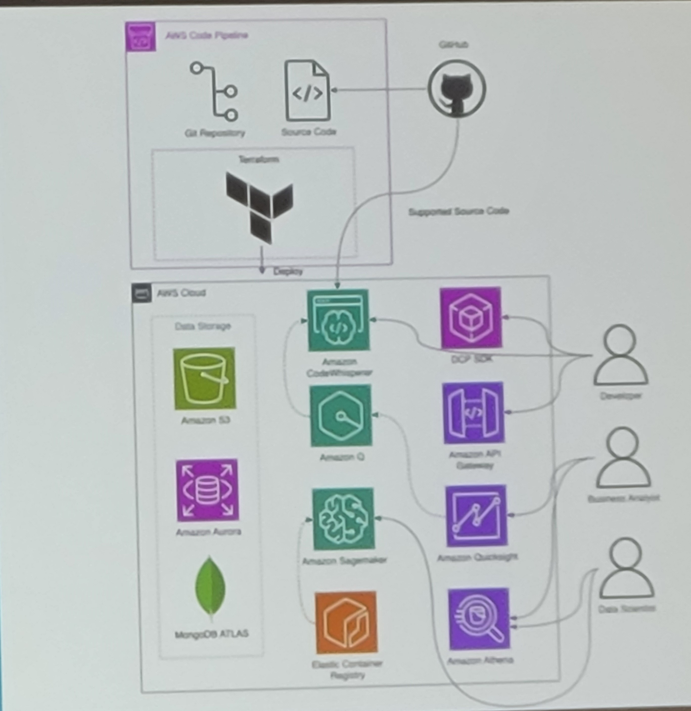
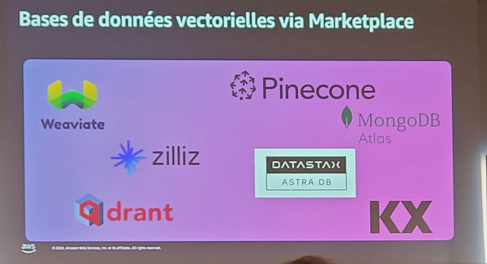

*03 avril 2024 | Palais des congrès | Paris*

*AWS Summmit Paris 2024*

https://aws.amazon.com/fr/events/summits/emea/paris/[AWS Summmit Paris]

https://aws.amazon.com/fr/events/summits/emea/paris/agenda/?emea-event-agenda-card.sort-by=item.additionalFields.time&emea-event-agenda-card.sort-order=asc&awsf.emea-event-agenda-session-type=*all&awsf.emea-event-agenda-level=*all&awsf.emea-event-agenda-role=*all&awsf.emea-event-agenda-category=*all[Programme]

-- -- -- -- -- --

*API309-FR +
Optimisez les coûts et la mise à l'échelle d'EKS avec Karpenter*

*par Imane Zeroual, AWS | Sebastien Allamand, AWS | Martinho Moreira, Voodoo*

Globalement un aperçu des nouvelles fonctionnalités de Karpenter dans le choix même du type de nodes.
Karpenter sait trouver les nodes les plus adaptés pour optimiser le coût.

_Voodoo_, éditeur de jeux mobiles en a fait l'expérience.

https://catalog.us-east-1.prod.workshops.aws/workshops/f6b4587e-b8a5-4a43-be87-26bd85a70aba/en-US[Workshop Karpenter on AWS]

--- 

*API309-FR +
Java ❤️ AWS*

*par Damien Metzler, AWS | Guillaume Delacour, AWS | Yacine Dries, Léon Grosse*

Rappel sur la responsabilité partagée par AWS sur les EC2

Lien avec le déploiement via CI CD

Java a la réputation d'avoir un temps de démarrage lent sur les Lambda, il existe un service pour y rémédier:
Aws lambda snapstart (10x plus vite)

_Léon Grosse_, entreprise de BTP, a su en tirer en profit.
Voici l'architecture initiale:

Ensuite, il a fallu passer le front sur S3, conteneuriser le back en Spring boot pour profiter de AWS Fargate.
La BDD a été passé en Aurora Serverless-Postegres pour maximiser le scaling et sortir des coûts de licensing.

Voici un aperçu global avec Gitlab et Terraform ainsi que les services d'authetification, la gestion des logs et secrets

Aperçu des bénéfices

Le GenAI étant le thème du moment.
AWS a parlé aussi de Q qui peut aider à upgrader les projets Java vers des versions plus récentes.

https://catalog.workshops.aws/java-on-aws-lambda/en-US[Workshop Java on AWS]

--- 

*API309-FR +
Le développeur augmenté : utilisez l'IA générative pour accélérer vos développements*

*par Olivier Jacques, AWS | Roger Simon, AWS | Vincent Dagoury, CTO AXA*

L'accent a été mis sur le fait qu'aujourd'hui. 
Les outils IA mis à disposition par AWS notemment Q, code whisperer ou encore Bedrock facilitent la recherche d'informations dans la doc.
Q peut se baser sur les normes propres à l'entreprise pour produire suggérer du code conforme à ces dernières.

Dans un exemple concret, on peut voir que Q permet de faciliter la résolution des CVE.
Q accompagne le développeur dans sa recherche de solution adéquate.

Le CTO d'Axa a présenté son REX et les  intérêts de tels outils ainsi que son impact sur une équipe (dev, business analyst, data scientist ) répartie dans 7 pays.

Allez plus loin 

https://catalog.workshops.aws/qbuilder/en-US[Lien Workshop Q]

---

*ANT212-FR + 
Choisir la base de données vectorielle pour son application GenAI*

*par Hajer Bouafif, AWS | Nicolas de Place, AWS | Quentin Grossetti, Film*

En IA Générative, les sources de données étant multiples(texte, audio, images etc.), la première étape consite à les ingérer.
Pour ce faire, il y a une étape primordiale qui est le classement.
On va donc vectoriser(pas simplement x,y,z mais bien au de-là avec une quasi infinité de dimensions)

Certaines bases de données sont adaptées pour ce besoin:

Lorsqu'on compare deux éléments dans une base vectorielle, on peut calculer la distance euclidienne comme en maths.
Cependant pour des vecteurs ayant des milliers de dimension, il existe d'autres approches pour faire de la recherche notamment:

https://opensearch.org/docs/latest/search-plugins/knn/index/[KNN]  ou
https://www.pinecone.io/learn/series/faiss/hnsw/[HNSW] ou IVF

https://www.datastax.com/fr/guides/what-is-a-vector-index[Méthodes d'indexation expliquée KNN, HNSW ou IVF] 

Voici un résumé des services avec leurs caractéristiques:

Exemple d'architecture AWS pour faire de la recherche d'images :

_Quentin Grossetti_ de _Film AI_ a ensuite parlé de la manière dont Film AI (Plateforme d'images pour les créatifs) utilise certains de ces algos.
Film ai permet de trouver/générer  des images à partir de texte mais aussi d'autres images d'où l'intéreêt sur les algos de recherche vectorielle.

https://flim.ai/[Fim AI]

---

*DOP305-FR + 
Démystifiez le développement d'applications web d'IA générative*

*par Steve Houël, AWS | Alexandre Pinhel, AWS*

Pour facilier le développement d'un business case ou POC, on utilise _Streamlit_ (librairie Python).
Pour la partie pure front, on se dirigera vers Anguler, React ou Vue lorsqu'on partira en prod si besoin.

Streamlit permet de nous concentrer sur le coeur de notre appli(la partie IA)

Streamit a un grand nombre d'éléments front déjà existants.
Dans notre exemple, nous partons sur un appli chat AI:

Voici les services qui peuvet nous aider. Au centre on trouve CodeCatalyst.
Amazon CodeCatalyst va permettre de faire le lien entre notre repo, les chaînes CI CD etc. 

Voci un exemple d'architecture:
Streamit fait le job directement dans le back pour rendre le visuel.

Au cours du développement, on s'aide de Code whisperer pour augmenter la productivité.

Dans le coeur du code, on fait du prompting dans le code, on retrouve les différents params pour les LLMs:

Pour aller plus loin:

https://aws.amazon.com/bedrock/[BedRock]

https://youtu.be/ab1mbj0acDo?si=hCa_QTHn1nTqvI50[Integration BedRock in your code]

https://catalog.us-east-1.prod.workshops.aws/workshops/a4bdb007-5600-4368-81c5-ff5b4154f518/en-US[Amazon Bedrock Workshop]

Code whisperer et Streamlit:

https://catalog.us-east-1.prod.workshops.aws/workshops/6838a1a5-4516-4153-90ce-ac49ca8e1357/en-US[Code whisperer workshop]
https://github.com/aws-samples/image-generator-with-stable-diffusion-on-amazon-bedrock-using-streamlit[Github image generator BedRock using Streamlit]

--- 

Mot de la fin:

Karpenter a toujours le vent en poupe sur Kubernetes/EKS surtout en terme de FinOps.
Java n'est pas mort/ ne veut pas mourir. Il s'intégre de mieux en mieux aux architecture serverless.

L'IA Générative ayant été encore une fois au centre des discussions, on se rend compte que l'on peut choisir son degré d'implication:
- rester en surface et être capable d'utiliser des API, réaliser des POC ou autres business cases très rapidement sans se soucier des GPU et autres contraintes 
  avec streamlit, Q, Bedrock, code whisperer etc.
- Construire des bases de données, utiliser plusieurs modèles ou encore optimiser ses algos.

Dans l'ensemble, on sent la volonté d'AWS d'apporter une approche en légo où chaque client vient construire sa solution en choisissant son degré d'implication dans l'IA.

